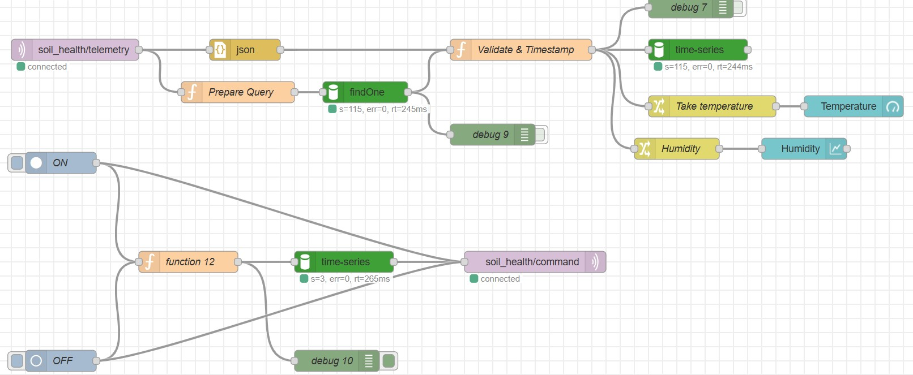

# Edge-Gateway-Climate-Monitoring
IoT Node-RED and ESP32 project for environmental monitoring via local EMQX broke

# AtmosSense IoT: Secure Climate Gateway 🌡️☁️

An Edge IoT Gateway-based microclimate and ambient temperature monitoring system. This project is developed for academic purposes and research at Universiti Teknikal Malaysia Melaka (UTeM), focusing on real-time telemetry, secure authentication layers, and cloud database management.

---

## 🛠️ Hardware & Software Components

### Hardware
* ESP32 Microcontroller (NodeMCU/DevKit)
* DHT11 Temperature & Humidity Sensor
* Jumper Wires
* Breadboard

### Software & Services
* **Arduino IDE:** C++ code development environment for the ESP32.
* **EMQX Broker (Local):** Local MQTT server for fast and secure data communication.
* **Node-RED:** IoT integration platform used for data parsing and visualizing the Dashboard.
* **MongoDB Atlas:** Cloud NoSQL database for storing historical data logs with timestamps.

---

## 📸 System Overview

---

## ⚙️ How the System Works

The system architecture is divided into two main streams: the Telemetry Path (Uplink) and the Command Path (Downlink).

### 1. Telemetry Path (Data Monitoring)
1. **Data Collection:** The DHT11 sensor reads the ambient temperature and humidity values every 5 seconds.
2. **Secure Transmission:** The ESP32 packages the readings into a JSON format and publishes them to the `env/telemetry` topic via the local EMQX broker using authenticated credentials.
3. **Edge Processing:** Node-RED (acting as the Edge Gateway) subscribes to the topic, parses the JSON object, and isolates the temperature and humidity values.
4. **Visualization & Storage:** The processed data is directly displayed on visual indicators (Gauge & Chart) on the Node-RED Dashboard. Simultaneously, the system injects a timestamp and stores the record into a time-series collection in MongoDB Atlas.

### 2. Command Path (Manual Control)
1. **Command Trigger:** The user presses the ON or OFF button on the Node-RED Dashboard interface.
2. **Signal Distribution:** Node-RED formats the signal and publishes it to the `env/command` MQTT topic.
3. **Hardware Execution:** The ESP32, continuously listening to the command topic, receives the message and toggles the physical LED/Relay accordingly.
4. **System Logging:** Every button press is recorded into the MongoDB database as an audit trail.

---

## 🚀 Quick Start Guide

1. Clone this repository to your local machine.
2. Open the `flows.json` file and import it into your Node-RED workspace.
3. Ensure the EMQX service is running on `localhost` (Port 1883) with the properly configured MQTT user authentication.
4. Upload the `.ino` code to your ESP32, ensuring the WiFi SSID and local EMQX IP settings are correctly updated.
